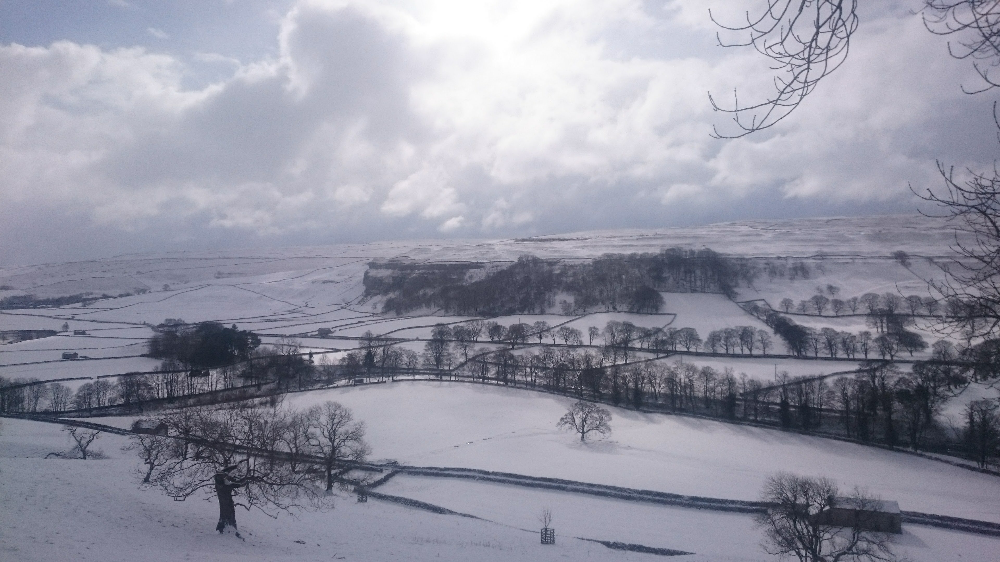

## A wet day for a run

The first race of my runfurther series goal for the year and the closer it got the worse the weather became. The final forecast being windy and absolutley chucking it down with rain.

On arriving I could see that the forcast was spot on and it was a day to start in waterproofs. Setting off the wind was immidiatly playing its part and I tried to tuck in between runners and occasionally pushing onto the tail end of another. I found this qiute fun and a bit like bike racing but was keen not to push to hard early on.

I started to feel quite good coming up to widdup but know the next section was going to be tough directly into the wind on an exposed moor. The wind was wipping water over the reservoir wall but at least there was a brief lull in the rain.

'My first run since coming out of pot so I was a bit concerned if I would actually get round or not? But with the struggle of qualifying and the effort of getting a ticket then I was not going to miss the 3 Peaks World Mountain Running Championships.

The race was a real occasion. Huge in fell running terms! There was film crews, thousands of people along the route and a huge amount of runners.

I placed myself within my estimated time pen at the start with an estimated 4 hour finishing time. In retrospect a tad ambitious being my first proper run in months.

A slow start and a long grind up to the top of Pen y Gent and then the descent from Pen Y Gent my first tentative footsteps on uneven ground.  My ankle was fairing up well (probably more to do with the huge amount of tape on my ankle). Along up to Whernside and things were going okay, then the lack of training really kicked in. Ingleborough a struggle up and a nightmare on the way down, apart from a brief moment where friends had gathered to cheer and jeer.

All in all good to be racing but prefered getting drunk in the pub that night to the run during the day.

I had been looking forward to racing this route for a while. One of our club championship races and one that I needed to qualify as I had not ran any of the long races yet. So I needed a good result to get me up in the rankings. I was figuring 3 hours would be a good goal to go for and wrote some split times down from last time sportident was used. I was all set to race!

Getting ready for the race ended up being a bit of a rush so not only did I forget the splits I also forgot my watch so my best laid plans were out the window.

I set off on the race with two conflicting voices in my head. The first voice was saying “go faster, run harder” the other voice was saying “keep it steady, wait for the second half of the race”. These inner voices were nagging me all the way up the long ascent to the first checkpoint and despite being in view of the leaders through the clag the “keep it steady” voice was winning.

The route to checkpoint 2 is a long fast descent right back down to the valley floor before another steep ascent. On this ascent the keep it steady voice was the dominant voice as the climb was hurting and I was only a couple of miles in. Time to get juiced up on gel and my new favorite sports food of Cliff Shot Blocks. By checkpoint 3 I has settled in a bit better although I think the weather turning for the worst was helping me as I like a bit of rain and clag. Makes it more fun. 3 to 4 was uneventful and not as hard as I thought it was going to be. A chore getting up the hills and a bit slippy on the downhills but the steep descents are great and some of the fastest steepest descents I have done in any race.

Coming into checkpoint 4 I was having a bit of trouble contouring with my left foot so dropped down to the path early on a straight descent line and then ran along the flat instead of the better diagonal line down to the checkpoint. This lost me a bit of time bu got me where I wanted in good shape for the long drag up to the Calf and checkpoint 5. A mixture of fast walking and running up here gained a fair few places. The Calf was quite inhospitable with visability of a couple of metres and driving rain I wasn’t hanging around any more and was time to put my foot down a bit. The good paths meant I could stretch out and listen to the other voice in my head telling me to go as fast as I could. Picking up sneaky shortcuts and running well on the paths meant I had picked off a couple of other people by the time I reached Winder and the last checkpoint.

The descent from the last checkpoint is a cruel one at the end of the race. A plummet down off the fells at a steep angle that the thighs don’t thank you for. The wrong line can send you into head height ferns and a good line takes you on the smoothest grassy descent you could find. I sort of knew a good line but risked following some other runners as they seem to be taking a more direct line. This worked well and I managed to catch one of them by the bottom of the descent and overtook him just as we left the fells for the final sprint down the road.

Final result 29th I think? In a time of 2 hours 45 minutes. Winner was in 2.19 (i think?) Very happy with that! Expecting around 3 hours, secretly hoping for sub 3 hours but kept that goal quiet.
