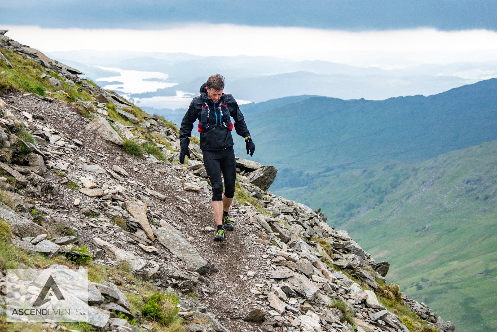

Some days your just flying, miles pass before you realise you have done them and you are in a flow that feels like it could last forever. This was NOT one of those days!

Just not a good day in the office. I am not sure what happened. Just a multitude of things made it a tough day out.

The last race for me to qualify for the [runfurther races ](http://runfurther.com 'Runfurther ultra running series') and I was feeling good and looking forward to it. My last run at the fellsman was a good one so was hoping to have another good run.

An early start to drive up to the lakes consigned me to the couch so I don't wake anyone up. I got picked up at 5.30 and was up to the lakes no problem. A bit of faffing around pre race and a jog to warm up. Things felt good and I was ready to go.

## The start or the beginning of the end?

Setting off towards Loughrigg along the road was at a fast pace but everything felt good.

Then we hit the first incline and my legs just did not want to do anything uphill? Slightly confused by this I knocked back the pace and thought maybe I was going a bit fast? The road kept uphill, to be replaced with trail and then fell. This point the first hill felt hard to even walk. Heart rate rocketing and sweat dripping from me. 2 miles down 31 to go!

### Okay I may grow into this?

Dropping off Loughrigg I thought its a good gradient to get into a groove and stretch the legs. Its a great trail down to the park in Ambleside and was soon through the checkpoint and up to the next climb. This one felt better. Still losing places every time the gradient went uphill but I was not pushing as hard. It's a simple ascent and your soon back down.

#### Okay I may grow into this race?

After a long descent into troutbeck, its over Garburn pass before dropping into Kentmere. I knew this bit and knew it should be runnable all the way. It was although it was tough for me not to stop as that was all I wanted to do. I felt like I was really putting in an effort yet people were still regularly going past me and off into the distance that was now just clag.

Arriving in Kentmere, grabbing some drink and pretty much leaving all the food it was off up to Nan Bield and the high tougher section of the route. This was the bit I was meant to be saving myself for.

## Some days are just not meant to be

I was knackered, my gut felt rough, my legs were shot and now to top it all off I had a splitting headache. I was looking at the big hill in front of me, struggling to run on the flat bit. If I can just get up onto the top it will be alright.

The further up I went the worse my headache was. I found myself squinting and closing my left eye on the way up. I felt rubbish and I didn't know why?

Eventually my head went. Stop pushing myself and just get round. Hopefully my headache will go. This was the crux of the race and I had reverted to a training run. So much so I even had a sit down on the way up.

Easing off meant a steady stream of people coming past me. Everyone quite spaced out by this point. The tops were in clag with the occasional gap into the clouds to see.

A slow run aross the top part of the route but soon enough at the next checkpoint at red screes. This time I shoved a load of sandwiches down my mouth which instantly sorted my stomach but my head still hurt. Filling up with loads of water, it was a slow stop but needed before tackling the long run in.

The run in from there was one of just getting round. I wanted it to be over. Bored of running with a headache and a poor performance.

Eventually it finished and I was presented with a medal. A weird concept which felt like school sports day where everyone wins.

##
