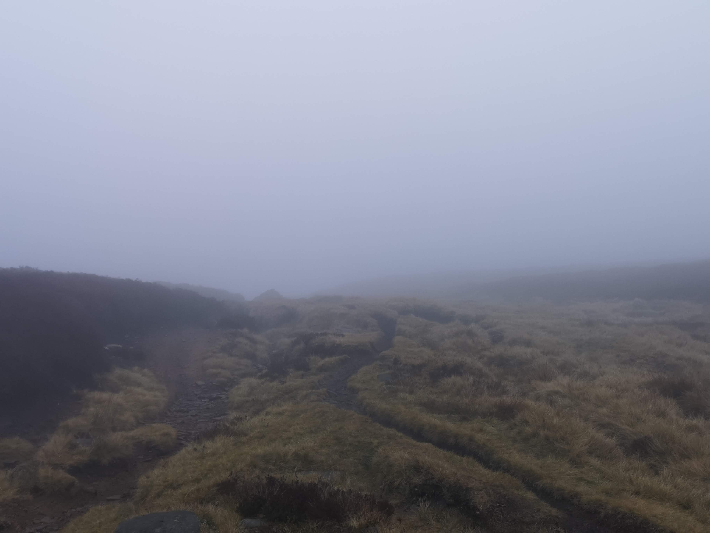
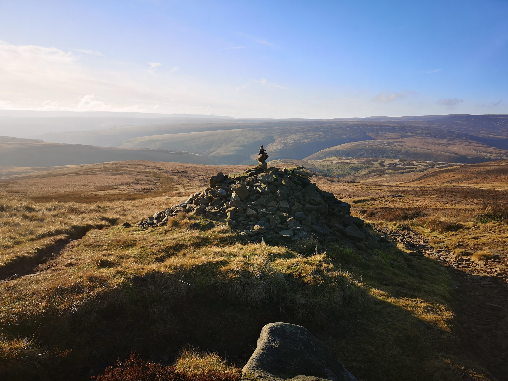

Autumn quickly turned to winter and the slow wander from consistent training to the warm glow of the front room had taken firm hold.

It is time to knock off the rust and get out and remind myself of the feeling of freedom that only being out in the hills can give.

## You come for the views

You come for the views but they cannot be guaranteed, but the atmosphere of a claggy day is second to none. At one with yoru surroundings, in the moment relying on map and compass.

Pushing up hills until either the legs or lungs give in. ALways trying despratly for it not to be the mind that quits first.

