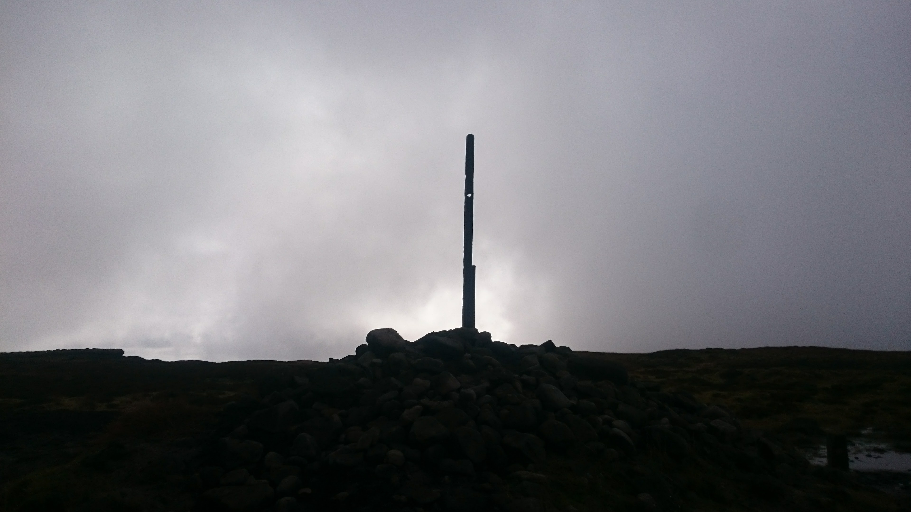

Always a good start to the year. Long hard, often tales of people wandering Kinder lost. A test of how much the mince pies and wine have hampered you over the Christmas period.

I entered late and knew I was not fit enough to race but certainly fit enought to run. Not detered by the idea of slopping through mud for 24 miles the entry was in.

This race is a point to point race, from Marsden to Edale so transport is always a bit of a faff. I saw this as an opportunity to try out my new (to me) van. I went to the finish in Edale the evening before to sleep overnight as it would be an early start to leave cars and get to the start by 8am. I have to say my first night in the van was a great success. Loads of comfy sleep and even better was a huge amount of room for faffing in the morning.

The plan was simple...start slow and maintain it. After many years, I am starting to be able to manage this, however as a race tactic it is pretty rubbish. My overall fitness dictated that to make this anything other than absolutley miserable then this needed to be the way.

Setting off, hat on gloves on waterproof on. If I was going slow I wanted to be warm. The procession up to towards black hill was okay. Some massive puddles which for some strange reason everyone including me avoided, despite it just prolonging the inevitable drenching that was happening from the rain and he upcoing bogs, river crossings and general filth of the peak district.

Onto the paving slabs towards Black hill, this taking it easy lark is okay. Almost a pleasure compared to the eyeballs out pain of racing. Complacency was setting in, chatting about how the stne slabs were lethal and slippy meant that I was obviously going to fall on them. Waiting until there was some steps my legs flew up in the air and my bum landed on the edge of a step. I was quickly up and after a few metres of just checking myself I realised I got away with it.

I followed from Black hill and we probably took the wrong turn off the top and then the long slop through mud all the way to the finish began.

This year had a route change so we followed the pennine way up towards Bleaklow. The ideal route would be 1km on a bearing towards ...... but having not recced I too the safe route up to bleaklow and then the normal race route from there. It added distance but was a safer route. I think I lost a fair few places from those who managed to hit the direct line.

The run up to Kinder was uneventful enough. The slow strt made me cach up with a few people and a recent recce meant I took a great line towards the finish.

COming in about a mile from the end, I saw Jasmin Paris up front. First person I had seen in a while and it gave me something to chase. I was catching towards the final desent but missed a line that Jasmin took for a beter shorter line into the final field. the chase was finally killed with a long slide down a sodden field on my arse.
